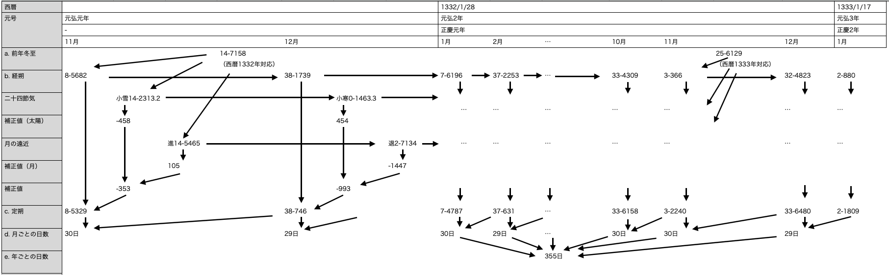

# 共通の求め方

全暦で共通に行う求め方を記載する

これから記すことは原則として実装の問題であり、計算手順そのものは特定の資料に依拠するものではない

『日本暦日原典』と同等の計算結果を出すためには、暦法編（同p.491〜）だけでは不十分である

本ライブラリの目的の一つは、与えられた西暦日/和暦日から、対象の和暦日（和暦計算結果）を取りだすことにある

この西暦日から和暦日を引き当てるための手順を記載する

# 元号
## 元号の検索

西暦年月日から対象の元号を特定する

西暦日と元号の対応関係については、 [元号](../../gengou.md) に記載してある

一例として、878年01月01日であれば、 `元慶（ 877/06/01 ～ 885/03/10 ）` の範囲内であることが分かる

これにより、該当の元号を特定できる

## 範囲の詳細

対象の西暦年月日をもとに、計算に必要な範囲を求める

これは和暦の特徴になるが、ある年の日数は計算するまで分からない

例えば貞観2年を求めたい場合、貞観1年の日数がなければ2年目の元旦が分からない

これは太陽暦（グレゴリオ暦）だけでは想像しづらい手続きである

グレゴリオ暦は閏が規則的で、年だけで年日数を計算できる

例えば2022年は357日（閏年）で、2021年は356日（平年）であると計算できる

一方、和暦を計算する際は、1年目から愚直に2年目以降を計算しなければならない

すでに元号の西暦開始日は特定しているので、1年目の開始年月日を特定し、

そこから2年目以降を計算することになる

このような前提を踏まえ、実際に計算範囲を求めるために次の条件で求める

### 条件1

* 西暦開始日・終了日から計算する範囲を求める
* 西暦開始日・終了日の範囲内にある元号全てが対象となる

これは基本的なルールと言えるだろう

求めたい範囲が 858/01/01 ～ 860/01/01 の場合、 `天安（857-03-20 ～ 859/05/19）` 、

`貞観（859/05/20 ～ 877/05/31）` が対象になる

### 条件2

* 元号に応じて計算範囲は変化する
  * 元号の開始日（改元日）が開始日よりも前であれば、結果開始日は前者になる
  * 元号の終了日（改元前日）が終了日よりも後であれば、結果終了日は前者になる
  * 南北朝のように複数元号に属する場合、より広い範囲の元号に合わせる

これは条件1の結果を踏まえ、計算範囲を拡大することを意味している

先の 858/01/01 ～ 860/01/01 であれば、次の範囲まで拡大する

857/03/20（天安の西暦開始日） ～ 877/05/31（貞観の西暦終了日）

また、南北朝のように複数元号であれば、より範囲に合わせることになる

求めたい範囲が `暦応（1338/10/11 ～ 1342/05/31）` と `延元（1336/04/11 ～ 1340/05/24）`

のどちらにも該当する場合、次の範囲まで拡大する

1338/10/11（暦応の西暦開始日） ～ 1340/05/24（延元の西暦終了日）

### 条件3

* 属する元号よりもさらに範囲を広げる場合がある
  * 開始日が最初の元号の改元後30日以内の場合、さらに前の元号まで対象にする
  * 終了日が最後の元号の改元前日30日以内の場合、さらに次の元号まで対象にする

これは実際に施行された暦 / 計算された暦のズレを完全に解消するため追加した

例えば、次のように年を跨いで月の位置づけ（名称）が変わるパターンがある

* 月初日（763/01/19）: 1月 -> 閏12月
* 月初日（764/02/06）: 閏12月 -> 1月

仮に 764/02/06 が元号の開始日であったとする

この場合、その手前の月（763/01/19）の計算結果がないため、

その月が持っている情報（中気の情報）を対象の月（764/02/06）に寄せることができない

このような情報の欠落を防ぐため、前後でマージンを取ることにした

なお、これは宣明暦以前で実例がないため、あくまで仮定の話でしかない

計算手順の汎用性を重んじ、あえて条件として追加している

# 暦
## 暦の検索

西暦年月日から対象の暦を特定する

『日本暦日原典』を参考に、次の対応関係を抽出した

|開始日|暦   |
|:----|:----|
|445/01/24|元嘉暦|
|698/02/16|儀鳳暦|
|764/02/07|大衍暦|
|862/02/03|宣明暦|
|1685/02/04|貞享暦|
|1755/02/11|宝暦暦|
|1798/02/16|寛政暦|
|1844/02/18|天保暦|
|1872/12/09|グレゴリオ暦|

一例として、450年01月01日であれば、 `元嘉暦` の範囲内であることが分かる

これにより、対象の年月日ではどの暦で計算すべきかを特定できる

## 範囲の詳細

元号での計算範囲をもとに、暦の計算範囲を定める

基本的に、暦の施行日と、元号の改元日は重ならない

例えば貞観3年までは大衍暦、貞観4年からは宣明暦となっている

一例として、計算範囲が貞観の範囲内（ `859-5-20 ～ 877/05/31` ）である場合、

暦の適用範囲は次の通りとなる

* 大衍暦：貞観開始日（859-5-20） 〜 大衍暦終了日（862/02/02）
* 宣明暦：宣明暦開始日（862/02/03） 〜 貞観終了日（877/05/31）

仮に貞観5年を計算したい場合は、貞観3年までを大衍暦で計算し、

貞観4年からは宣明暦で計算することで正しい年月日が得られることになる

TODO: 次の内容を上で清書すること

### 計算の流れ

正慶1年の日数を出すための流れを図示する

最後の「355日」を出すためには、月ごとの日数を出す必要がある

月ごとの日数は定朔によって得られるが、それは経朔を補正することで得られる

この図の正慶1年は宣明暦に属するため、定朔まで求める必要がある

11月定朔に必要な「経朔」「入定気（二十四節気）」「月の進退」は冬至計算で求められる

従って、まずは各年の冬至を求めなければならない

計算の多くはそれぞれの暦に依存するが、まずは共通の計算部分を列挙する

### 元号の求め方

元慶（877-6-1 ～ 885-3-10）をもとに考える

元号開始年が存在する元号年（877）から、次の元号の開始年（885） + 1 までを和暦計算する。これをAとする

元号のはじまりは固定値のため、西暦開始日と、それに対応する和暦開始日を持つ（例: 元慶01年04月16日 = 877-6-1）

この和暦開始日は必ずAの1年目に存在するため、1年目の和暦日を特定し、その日と西暦開始日を関連付ける

もし元慶2年以降を計算したい場合は、Aの西暦開始日から該当年月日までを加算で求める

具体的には、和暦上の月の大小（29日 or 30日）を用いた加算となる

念のため補足するが、西暦（太陽暦）のように1年あたりの日数は一定しない

平年（353/354/355/356）または閏年(383/384/385）のパターンがあり、月の大小（29/30）や閏月（中気のない月）の有無で変動する

したがって、2年目以降を加算なしに特定することはできない

### 南北朝について

南北朝による元号の並立がある（正慶１年 / 元弘2年）

このような場合、元号は早くから始まったほうを基準に計算しなければならない（正慶 よりは 元弘 の方が一年早い）

並立は最大でも2つであり、並びは『日本暦日原典』に従う

