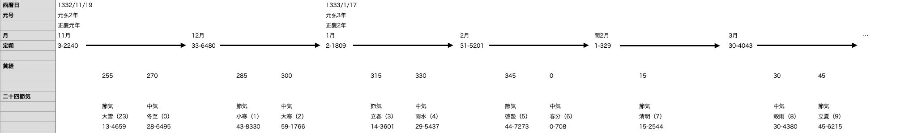

# 太陰太陽暦

和暦は太陰太陽暦である

太陰太陽暦の文化的・歴史的な背景には触れず、ここでは暦計算する上で必要なことのみ言及する

私たち現代の日本人が使うグレゴリオ暦は太陽暦である

太陽暦は `年` を太陽に対する公転周期、 `日` を地球の自転周期で求める

太陰太陽暦はそれに加えて、`月` を月の満ち欠けの周期（朔望月）に合わせる

本来この `年` と `月` の周期には何らかの関連性はなく、暦の側で辻褄合わせする必要がある

（今回は触れないが、メトン周期はこのような辻褄合わせの一つである）

`年` の太陽年は約365.24日、 `月` の1朔望月は約29.5日である

1朔望月 * 12 = 354日であり、 1太陽年には常に約11日ほど満たないことになる

古代中国人はこれを12ヶ月の平年（353/354/355/356日）と、13ヶ月の閏年(383/384/385日）で解決した

問題は1年に含まれる朔望月のそれぞれを1月、2月...などと位置付けるのか

これを理解するために、元弘元年-元弘2年を例にする

「定朔」は月の始まりを示す

毎月1日の始まりであり、ここから次の月までは1朔望月かかる

（「定朔」は儀鳳暦以降に用いられており、元嘉暦は「平朔」となる）

具体的に言えば、朔月（新月）-> 上弦 -> 望月（満月） -> 下弦 -> 次の朔月（新月）と約29.5日かけて移り変わる

下の「黄経」は（地球から見える）太陽の位置を示し、360度で1太陽年が経過する

この黄経15度ごとに名前が与えられており、これを「二十四節気」と呼ぶ

宣明暦ではこの定朔の範囲にどの二十四節気が含まれるかを計算し、中気に対応する月名を与えている

11月を例に取ると、「3-2240」と「33-6480」の間には大雪（「13-4659」）と冬至（「28-6495」）が含まれている

この大余小余（xx-xxxx）の表現を細かくは説明しないが、とりあえずは左側の数字だけ見ていただければ良い

この冬至は11月の中気であり、これが含まれている1朔望月を「11月」と呼ぶ

次に閏2月を例に取ると、中気が一つも含まれていないことが分かる

「1-329」と「30-4043」の間には節気しかない

これを閏月と呼び、これが含まれる元弘3年は13ヶ月ある閏年になる

このように、太陰太陽暦では太陽の位置を24分割し、月の所属を明らかにする方法を取っている
