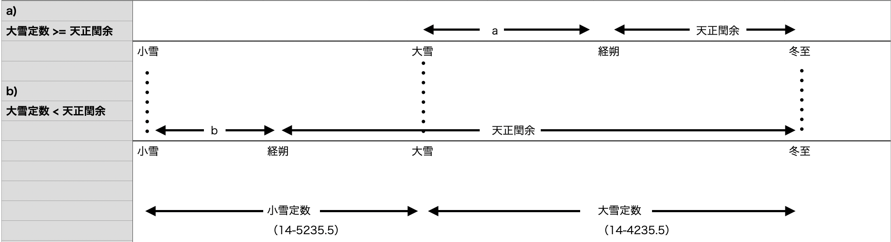

# 宣明暦の11月朔日計算

『日本暦日原典』『長慶宣明暦算法』では入定気の計算が不完全である

天正閏余を求めた後で、大雪定数/小雪定数を差し引きしているが、立冬定数を利用する例がない

# 計算失敗例

次の年では計算に失敗していた

| 対応年 | 文献（月） | 文献（大余小余） | 計算（月） | 計算（大余小余） | 天正閏余 |
| ------ | ---------- | ---------------- | ---------- | ---------------- | -------- |
| 1032   | 閏10       | 41-7048          | 閏10       | 41-676           | 29-4185  |
| 1051   | 11         | 20-5089          | 閏10       | 21-7118          | 29-3835  |
| 1070   | 11         | 0-822            | 11         | 0-2851           | 29-3485  |
| 1089   | 閏10       | 39-3508          | 閏10       | 39-5538          | 29-3135  |
| 1108   | 閏10       | 19-7769          | 閏10       | 19-1400          | 29-2785  |
| 1127   | 閏10       | 58-5899          | 閏10       | 59-7931          | 29-2435  |
| 1146   | 閏10       | 38-6128          | 閏10       | 39-8161          | 29-2085  |
| 1165   | 11         | 18-5932          | 閏10       | 19-7966          | 29-1735  |
| 1184   | 11         | 58-3492          | 閏10       | 58-5526          | 29-1385  |

# 原因

小雪定数（14-5235.5）と大雪定数（14-4235.5）の和は  `29-1071.3` である

小雪・大雪の範囲を突き抜け、さらにその手前の立冬にまで進入したことを示している

# 対策

パターンCのケースを追加する

a: `大雪定数` (14-5235.5) - `天正閏余`

b: `小雪定数` (14-4235.5) - ( `天正閏余` - `大雪定数` (14-5235.5))

c: `立冬定数` (14-6235.5) - ( `天正閏余` - ( `大雪定数` (14-5235.5) + `小雪定数` (14-4235.5) ) )

