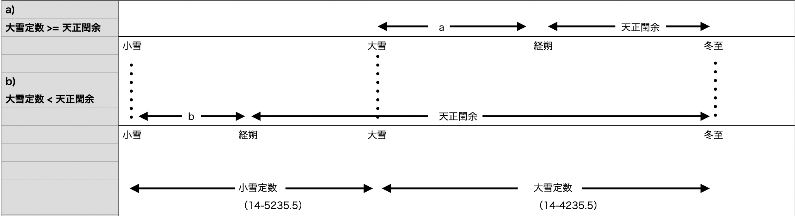
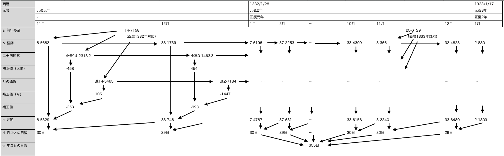
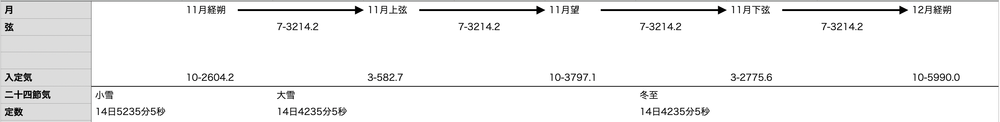
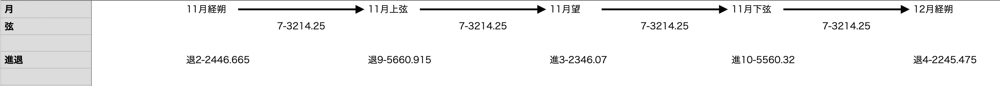

# 宣明暦

貞観4年1月1日（862/02/03）-貞享1年12月30日（1685/02/03）

# 著者

[pldb](https://github.com/pldb)

# 前提

宣明暦は太陰太陽暦である

詳細は [太陰太陽暦](./section/lunisolar_calendar.md) に記載してある

# 計算

計算にあたって、暦共通の計算と、宣明暦固有の計算がある

暦共通の計算は前処理/後処理として説明する

その間に宣明暦固有の計算を説明することとする

## 共通前処理

詳細は [共通前処理](./section/common_pre_process.md) に記載してある

## 宣明暦固有の計算

計算手順を以下に示す

1. 11月定朔（補正後の月初日）を求める
    1. 対象の西暦年から前年冬至を求める
    2. 対象の西暦年から冬至の月齢を求める
    3. 前年冬至から11月経朔（補正前の月初日）を求める
    4. 二十四節気から太陽の運動の補正値を求める
    5. 月の進退から月の運動の補正値を求める
    6. 太陽・月の運動の補正値から11月定朔（補正後の月初日）を求める
2. 12月定朔（補正後の月初日）を求める
    1. 11月経朔を進めて12月経朔を求める
    2. 11月の二十四節気を進めて12月の二十四節気を求める
    3. 12月の二十四節気から太陽の運動の補正値を求める
    4. 11月の月の進退を進めて12月の月の進退を求める
    5. 12月の月の進退から月の運動の補正値を求める
    6. 太陽・月の運動の補正値から12月定朔（補正後の月初日）を求める

1の計算方法は『日本暦日原典』p.511-516に依拠する

2は 「安藤有益著『再考長慶宣明暦算法』 について」、さらにその元となる「長慶宣明暦算法」に依拠する

### 11月定朔（補正後の月初日）を求める

『日本暦日原典』に倣い、慶安3年（1650年）を元に計算例を示す

原文は「長慶宣明暦算法」を引用しつつ説明しているが、計算に必要な部分のみ取り出し説明する

なお、計算の背景を理解のため適宜補足し、「こえた場合」「より大きい」など境界値の扱いが曖昧な表現は、分かる表現に改めることとする

#### 対象の西暦年から前年冬至を求める

まずは `天正冬至` （前年冬至）を求める

`積年` （7070138年）+ `西暦年` （1650年） - `宣明暦作成年` （長慶2年: 822年） = 7070966年 ...(1)

まずは積年で経過年を求める（積年の根拠は「宣明暦の積年と暦元について」に詳しい）

積年の始まりは甲子夜半朔旦冬至（冬至の日で朔日、かつ十干十二支の60通りの1番目の日、かつ1日の始まりである夜半）である

`(1)結果` （7070966年） % `旬周` （60日: 504000）= （余り）95130 ...(2)

次に60日で割り、直近の甲子（60日ある十干十二支の1番目）から数えた経過を求める

`(2)結果` (95130) / `統法（1日）` （8400） = 11 ... 余り 2730 ...(3)

この(3)の 大余小余(11-2730) が慶安3年（1650年）の `天正冬至` （前年冬至）である

#### 対象の西暦年から冬至の月齢を求める

次に `天正閏余` （冬至の月齢）を求める

`(1)結果` （7070966年） % `章月（1朔望月）` （248057） = （余り）125370 ...(4)

経過年を1朔望月で割り、直近の朔月（新月）からの経過を求める

`(4)結果` (125370) * `章閏法` (91371) % `章月（1朔望月）` （248057） = （余り）158067 ...(5)

章閏法は `1太陽年（3068055） - 12朔望月（248057 * 12）` で求められる

これは原文にない筆者自身の考察だが、上記(4)-(5) はまわりくどい求め方である

`(1)結果` (7070966年) * `1太陽年` (3068055) % `章月（1朔望月）` (248057)

この式と結果は変わらないが、思うに、乗算で大きい桁数を扱うのを避けたのではないだろうか

`(5)結果` (158067) / `統法（1日）` （8400） = 18 ... 余り 6867 ...(6)

この(6) の 大余小余(18-6867) が慶安3年（1650年）の `天正閏余` （冬至の月齢）である

#### 前年冬至から11月経朔（補正前の月初日）を求める

次に `11月経朔（補正前の月初日）` を求める

先述の通り、冬至の含まれる月が11月である

また、冬至の月齢をすでに得ているので、11月内の朔月（新月）まで遡って求めることができる

`天正冬至` （前年冬至） - `天正閏余` （冬至の月齢）
  = 大余小余(11-2730)  - 大余小余(18-6867)
  = 大余小余(52-4263)

大余小余の説明をすると、大余は60で繰り上がって0に戻り、小余は8400で繰り上がって大余1を加える

上記の減算をする場合、小余 2730 - 6867 は大余1から小余8400を足して引く

大余 11 - 18 は小余計算で使った1を引き、さらに常に60未満のため、60を足して引く

こうして得られた 大余小余(52-4263) が慶安3年（1650年）の前年の `11月経朔（補正前の月初日）` である

#### 二十四節気から太陽の運動の補正値を求める

`11月経朔（補正前の月初日）` を補正するために、太陽の運動の補正値を求める

地球は太陽の周りを楕円に周っている

したがって二十四節気に従い、黄経15度ずつ分割しただけではそれぞれの進み方の違い（冬早く夏遅く）を表現できない

この二十四節気ごとの進みの違いは後述する「入気定日加減数」で定義されているが、今はこのうちの小雪（14秒5235分5秒）、大雪（14日4235分5秒）のみ意識すれば良い

前提として、11月の朔日は二十四節気の小雪〜大雪、または大雪〜冬至の範囲内にある

上記はp.513の第五図を参考の上、下記の変更を加えている

* 原文はa/bの条件がどちらも「より大きい」となっていたので、境界値の扱いが分かる表記に変えた
* 定数の値を併記した

この図で示した通り、求め方はaかbかで異なる

求める対象は定気（経朔のある二十四節気の始まり）から経朔までの経過であり、以下の減算で求められる

a: `大雪定数` (14-5235.5) - `天正閏余`

b: `小雪定数` (14-4235.5) - ( `天正閏余` - `大雪定数` (14-5235.5))

（ これは不完全な計算である。詳細は [宣明暦の11月朔日計算](./section/senmyou_november_1st.md) を参照のこと）

慶安3年（1650年）の `天正閏余` (18-6867) はbのパターンであり、以下のように計算できる

18-6867 - 14-5235.5 = 4-2631.3

14-4235.5 - 4-2631.3 = 10-2604.2 ≒ 10-2604 （小数点以下切り捨て）

秒の単位を扱うのはここが初めてだが、 1分=8秒として計算する

最後に秒の切り捨てをしているのは以降の計算では使わないためである

次に損益率・眺朒（ちょうじく）数を求める

これは以下の「24気損益眺朒数」という表を用いる

|-|a（眺朒数の初日の値）|b（損益率初日の値）|c（一日ごとの差）|
|:----|:----|:----|:----|
|冬至（とうじ）|0.0|+33.4511|-0.3695|
|小寒（しょうかん）|+449.0|+28.0389|-0.3606|
|大寒（だいかん）|+823.0|+22.6998|-0.3519|
|立春（りっしゅん）|+1122.0|+17.8923|-0.4068|
|雨水（うすい）|+1346.0|+11.7966|-0.3998|
|啓蟄（けいちつ）|+1481.0|+5.7986|-0.3998|
|春分（しゅんぶん）|+1526.0|-0.2433|-0.3779|
|清明（せいめい）|+1481.0|-6.1254|-0.3634|
|穀雨（こくう）|+1346.0|-12.2048|-0.2987|
|立夏（りっか）|+1122.0|-16.9060|-0.2919|
|小満（しょうまん）|+823.0|-21.5362|-0.2854|
|芒種（ぼうしゅ）|+449.0|-26.0498|-0.2854|
|夏至（げし）|0.0|-30.3119|+0.2854|
|小暑（しょうしょ）|-449.0|-25.8126|+0.2919|
|大暑（たいしょ）|-823.0|-21.2454|+0.2987|
|立秋（りっしゅう）|-1122.0|-17.0296|+0.3634|
|処暑（しょしょ）|-1346.0|-11.4744|+0.3779|
|白露（はくろ）|-1481.0|-5.6429|+0.3779|
|秋分（しゅうぶん）|-1526.0|+0.1432|+0.3998|
|寒露（かんろ）|-1481.0|+6.1488|+0.4068|
|霜降（そうこう）|-1346.0|+12.6336|+0.3519|
|立冬（りっとう）|-1122.0|+17.8043|+0.3606|
|小雪（しょうせつ）|-823.0|+23.0590|+0.3695|
|大雪（たいせつ）|-449.0|+28.4618|+0.3695|

定気の日からn日目の損益率/眺朒数を以下のように求める

* 損益率 = b + n * c
* 眺朒数 = a + (n * b) + (1/2)n * (n - 1) * c

先ほどの計算結果 10-2604 と、小雪（経朔のある二十四節気）を用いると次の通りに計算できる

損益率 = 23.0590 + 10 * 0.3695 = 26.7540

眺朒数 = -823.000 + (10 * 23.0590) + (1/2) * 10 * (10 - 1) * 0.3695
      = -823.000 + 230.5900 + 16.6275 = -575.7825

次に、損益率/眺朒数と計算結果 10-2604 を使って最終的な補正値を求める

(小数点以下切り捨ての損益率 * 小余) / `統法（1日）` （8400） = 26 * 2604 / 8400 = 8 ... 余り 504

この余りは4200以上なら切り上げるが、この場合は504なので切り捨てる

この8と 小数点以下切り捨ての眺朒数の -575 を足した値、 -567 が補正値になる

#### 月の進退から月の運動の補正値を求める

`11月経朔（補正前の月初日）` を補正するために、月の運動の補正値を求める

月もまた地球の公転運動と同じく楕円に周っている

したがって地球に近い（近地点）遠い（遠地点）があり、それによる補正値を求める

`(1)結果` （7070966年） * `章歳（1太陽年）` (3068055) = 21兆6941億1259万1130 ...(9)

積年を小余を基準にする

( `(9)結果` 21兆6941億1259万1130 - `天正閏余` (18-6867 : 158067) ) % `暦周（1近点月）` (231458.19) = (余り) 126575.76 ...(10)

月が近地点 -> 遠地点 -> 近地点と一巡する暦周（27.55454...日）を使って、直近の遠地点からの経過を求める

NOTE: 後述の表が遠地点始まりで地球に向かって進み、近地点から地球から離れるような構成のため「直近の遠地点」と表現している

なお、暦周の秒は1分=8秒ではなく1分=100秒であることに留意すること

`(10)結果` (126575.76) / `統法（1日）` （8400） = 15 ... 余り 575.76 ...(11)

この結果（ 15-575.76） は  `暦周（1近点月）` (231458.19) の半分の `暦中日（暦周の半分）` （13-6529.095） 以上である

この場合は減算する

`(11)結果` （15-575.76） - `暦中日（暦周の半分）` （13-6529.095） = 2-2446.665

この大余小余をもとに表から値を引く

|進退|入暦|小余（下限）|小余（上限）|損益率|眺朒積|備考|
|:----|:----|:----|:----|:----|:----|:----|
|進|01日|0000|8400|+830|0|-|
|進|02日|0000|8400|+726|+830|-|
|進|03日|0000|8400|+606|+1556|-|
|進|04日|0000|8400|+471|+2162|-|
|進|05日|0000|8400|+337|+2633|-|
|進|06日|0000|8400|+202|+2970|-|
|進|07日|0000|7465|+53|+3172|-|
|進|07日|7465|8400|-7|+3225|+3172 + 53（初益）|
|進|08日|0000|8400|-82|+3218|-|
|進|09日|0000|8400|-224|+3136|-|
|進|10日|0000|8400|-366|+2912|-|
|進|11日|0000|8400|-509|+2546|-|
|進|12日|0000|8400|-643|+2037|-|
|進|13日|0000|8400|-748|+1394|-|
|進|14日|0000|6529|-646|+646|14日の小余は常に6529以下|
|退|01日|0000|8400|-830|0|-|
|退|02日|0000|8400|-726|-830|-|
|退|03日|0000|8400|-598|-1556|-|
|退|04日|0000|8400|-464|-2154|-|
|退|05日|0000|8400|-329|-2618|-|
|退|06日|0000|8400|-195|-2947|-|
|退|07日|0000|7465|-53|-3142|-|
|退|07日|7465|8400|+7|-3195|-3142 - 53（初益）|
|退|08日|0000|8400|+82|-3188|-|
|退|09日|0000|8400|+225|-3106|-|
|退|10日|0000|8400|+366|-2881|-|
|退|11日|0000|8400|+501|-2515|-|
|退|12日|0000|8400|+628|-2014|-|
|退|13日|0000|8400|+740|-1386|-|
|退|14日|0000|6529|+646|-646|14日の小余は常に6529以下|

これは第14表に対して改変を加えた表である

原文の表には小余と備考の項目がない

備考はあくまで理解のためだが、小余はこの列がないばかりに余計な条件分岐が増えているため追加した

この表を使って実際に引き当てを行う

前回の結果（2-2446.665）を求めるに当たり、`暦中日（暦周の半分）` で減算したが、この場合は 進退列の`退` を見ることになる

まずは前回結果の小余を [小数点](./section/decimal.md) に従って切り捨て、 大余 2 、小余 2446 とする

次に大余に相当する入暦列、小余に相当する小余列を確認し、損益率 -726 / 眺朒積 -830 を引き当てる

( `損益率` (-726) * `小余` (2446) ) / `統法（1日）` （8400） = -211 ... 余り -3396

余りは四捨五入するが、これは `小余（上限）` (8400) - `小余（下限）` (0) = 8400 を基準にして、絶対値が半分の4200以上なら繰り上げる（繰り上げ方は正数であれば+1、負数であれば-1）

今回の -3396 は -4200 に到達しないため切り捨て、 計算結果は -211 となる

この -211 + (-830) = 1041 が月の補正値となる

今回のパターン外の補足として、7日の場合と14日の場合がある

7日は小余7465以下なら損益率+53、7465を超えた場合は-7である

14日は暦中日の範囲に従い、小余6529までとなる

#### 太陽・月の運動の補正値から11月定朔（補正後の月初日）を求める

これまでの結果をもとに定朔を求める

`11月経朔` (52-4263) + `太陽の運動の補正値` (-567) + `月の運動の補正値` (-1041) = 52-2655

こうして11月定朔が確定する

### 12月定朔（補正後の月初日）を求める

ここからは冬至が含まれる11月をもとに、次月以降を求める手続きを示す

例として12月が良いと考えられたため、12月を参考に求めることとする

なお、太陽・月の運動の補正値を求めるくだりは、「安藤有益著『再考長慶宣明暦算法』 について」p.89-90 を参考にする

再掲する形になるが、流れについては上記の図を参考にしてほしい

留意することとして、11月定朔から直接12月定朔を求めることはできない

#### 11月経朔を進めて12月経朔を求める

まずは前月経朔から当月経朔から求める

`11月経朔` (52-4263) + `章月` (29-4457) = 22-320

太陰太陽暦なので1ヶ月は1朔望月、つまり `章月` を指す

`章月` の大余小余は 248057 / 8400 = 29-4457 である

これを加算することで次月の経朔が得られるが、11月の時と同様にこれで終わりではない

#### 11月の二十四節気を進めて12月の二十四節気を求める

次に12月経朔に対応する入定気、つまり定気（経朔のある二十四節気の始まり）から経朔までの経過を求める

これには「入気定日加減数」を用いる

|二十四節気|経過|
|:----|:----|
|冬至（とうじ）・大雪（たいせつ）|14 日 4235 分 5 秒|
|小寒（しょうかん）・小雪（しょうせつ）|14 日 5235 分 5 秒|
|大寒（だいかん）・立冬（りっとう）|14 日 6235 分 5 秒|
|立春（りっしゅん）・霜降（そうこう）|14 日 7235 分 5 秒|
|雨水（うすい）・寒露（かんろ）|15 日 35 分 5 秒|
|啓蟄（けいちつ）・秋分（しゅうぶん）|15 日 1235 分 5 秒|
|春分（しゅんぶん）・白露（はくろ）|15 日 2435 分 5 秒|
|清明（せいめい）・処暑（しょしょ）|15 日 3635 分 5 秒|
|穀雨（こくう）・立秋（りっしゅう）|15 日 4835 分 5 秒|
|立夏（りっか）・大暑（たいしょ）|15 日 5835 分 5 秒|
|小満（しょうまん）・小暑（しょうしょ）|15 日 6835 分 5 秒|
|芒種（ぼうしゅ）・夏至（げし）|15 日 7835 分 5 秒|

これは第11表に相当する

11月ではこのうちの 小雪（14秒5235分5秒）、大雪（14日4235分5秒） のみ使用していた

12月以降を求めたい場合は、上記の定数を二十四節気の並びに合わせて順次使用する

12月経朔の入定気は、上図のように弦を4回足して得られる

定数を越えるたびに差分を取り、次の入定気として繰越し続ける

例えば最初は加算は次の通りである

`11月経朔の入定気` (10-2604.2) + `弦` (7-3214.2) = 17-5818.4

これは小雪定数以上なので、定数を差し引いて次の入定気とする

`加算結果` (17-5818.4) - `小雪定数` (14-5235.5) = 3-582.7

なお定数と同じく1分=8秒であることに注意する

この 3-582.7 は小雪の次の大雪に属することとなる

このように順次加算しつづけた結果、12月経朔の入定気、 冬至 10-5990.0 が得られる

#### 12月の二十四節気から太陽の運動の補正値を求める

ここは全く11月経朔と変わらないため過程は割愛する

冬至 10-5990.0 で「24気損益眺朒数」から対象の値を引いて計算する

結果、 +338 を得る

#### 11月の月の進退を進めて12月の月の進退を求める

次に12月経朔に対応する月の進退を求める

基本的な求め方は太陽の時と変わらない

12月経朔の月の進退は、上図のように弦を4回足して得られる

ただし、1分=100秒で計算しており、弦が 2/8 = 25/100 になっていることに注意する

11月経朔の時と同様、 `暦中日（暦周の半分）` （13-6529.095） 以上 であれば減算し、合わせて進退を逆転させる

このように順次加算しつづけた結果、12月経朔の月の進退、 退4-2245.475 が得られる

#### 12月の月の進退から月の運動の補正値を求める

ここは全く11月経朔と変わらないため過程は割愛する

退4-2245.475 で表から対象の値を引いて計算する

結果、 -2278 を得る

#### 太陽・月の運動の補正値から12月定朔（補正後の月初日）を求める

これまでの結果をもとに定朔を求める

`12月経朔` (22-320) + `太陽の運動の補正値` （+338） + `月の運動の補正値` (-2278) = 21-6780

ただし、このパターンはこれで終わりではない

これは11月12月といった話とも全く関係がないが、 [進朔](http://eco.mtk.nao.ac.jp/koyomi/wiki/C2C0B1A2C2C0CDDBCEF12FBFCABAF3.html) により1日分増える

具体的には、小余が1日の3/4、つまり 8400 * (3/4) = 6300 以上の場合、大余を1つ加算する必要がある

つまり、以下により12月定朔は確定する

21-6780 + 大余1 = 22-6780
## 共通後処理

詳細は [共通後処理](./section/common_post_process.md) に記載してある

# 結語

暦共通・宣明暦の暦算は以上である

# 参考文献

* 内田　正男『日本暦日原典』雄山閣出版 1975(1975)
* [「安藤有益著『再考長慶宣明暦算法』 について」](http://www.kurims.kyoto-u.ac.jp/~kyodo/kokyuroku/contents/pdf/1444-9.pdf)
